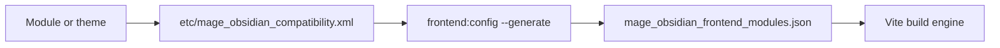

# Why MageObsidian

> **Note:** This project is developed in my free time, which may result in slower progress than expected. If you'd like to support its development and accelerate progress, consider contributing financially. More details can be found in the [Project Support](../project/sponsor.md) section.

## What it is

The **{{ config.site_name }}** project emerges as a disruptive proposal to revolutionize the frontend development experience in Magento. For years, Magento's frontend has been constrained by tools and practices that, while useful in their time, have added unnecessary complexity to the ecosystem. Technologies such as Less, Knockout, and RequireJS have turned development into a challenging process that overwhelms even experienced developers.

  
  
  
  
  

**{{ config.extra.components_name }}** aims to simplify and modernize Magento's frontend development with an innovative and open-source alternative. This project introduces two key aspects:

1. **{{ config.extra.components_name }}:**  
    Already available and open source, these tools have been created to implement a completely new approach to Magento theme development. They enable the integration of modern technologies like **Vite**, **TailwindCSS**, **Vue.js**, and **ESM** (native JavaScript modules), providing a more accessible, efficient, and developer-friendly experience.  
    [Learn more about {{ config.extra.components_name }}](index.md).

2. **{{ config.extra.theme_name }}:**  
    The base theme is built entirely on the mentioned tools and is already functional. It does not inherit anything from traditional themes like **Blank** or **Luma**, enabling a completely new design aligned with modern practices and free from the historical constraints of Magento's frontend. It targets Magento Open Source today; Adobe Commerce and Mage-OS are technically compatible as of core 2.6.0 but not fully tested yet.  
    [Learn more about {{ config.extra.theme_name }}](../guides/themes/obsidian.md) — or see it running in the [live demo]({{ config.extra.demo_url }}){target=_blank rel=noopener}.

One of the main strengths of **{{ config.extra.components_name }}** is that **it does not follow a PWA approach**. Instead, it leverages Magento's existing system of layouts, blocks, and templates, preserving its native architecture. This approach allows developers to take advantage of modern tools and current standards without compromising compatibility with existing modules and functionalities, offering a smoother and more efficient development experience.

On top of that native foundation, **{{ config.extra.components_name }}** layers in modern building blocks: Vue components mount as **lazy-hydrated [islands](../guides/vue/islands.md)**, a built-in **[i18n](../guides/vue/i18n.md)** layer translates them with Magento's native dictionaries, and an optional **[Twig engine](../guides/twig.md)** — included by default and fully compatible with `.phtml` — is available for those who want HTML auto-escaping and clean template inheritance.

Additionally, although the use of **NPM** packages has always been possible in Magento, **{{ config.extra.components_name }}** makes it simpler and more straightforward. Developers can now elegantly leverage the vast ecosystem of tools and libraries available, aligning Magento's frontend with global web development best practices.

## Key features

### Components

- **Independence from traditional themes:** **{{ config.extra.components_name }}** completely eliminates dependency on themes like **Blank** and **Luma**, enabling a modern and flexible design free from the historical constraints that have complicated Magento's frontend.

- **Integration with modern tools:** Leverages cutting-edge technologies such as **Vite**, **TailwindCSS**, **Vue.js**, and **ESM** (native JavaScript modules), providing an agile development experience aligned with global best practices.

- **Instant updates with Hot Module Replacement (HMR):** Delivers a seamless development experience by eliminating waiting times and enabling immediate updates during development.

- **Simplified access to the NPM ecosystem:** Streamlines the integration of modern tools and libraries through optimized **NPM** access, aligning Magento's frontend with current web development standards.

- **Centralized control over visual representation:** Introduces an approach where the primary control of visual representation resides in the theme, while modules can still make specific modifications. This ensures a clear separation of responsibilities, fostering more modular, organized, and flexible development.

- **Modernization leveraging native foundations:** Builds upon Magento's native system of Layouts, Blocks, and Templates to modernize the frontend, integrating the best of Magento's frontend ecosystem with modern tools.

- **Interactive Vue islands:** Vue components mount as independent, **lazy-hydrated islands** — below-the-fold components cost nothing until they enter the viewport, and a page with no islands ships no Vue at all. See [Vue Islands](../guides/vue/islands.md).

- **Built-in internationalization:** Translate phrases in components with `$t('…')` against Magento's native `js-translation.json`, with a collector command for the `.vue` sources. See [Internationalization](../guides/vue/i18n.md).

- **Built-in structured data (JSON-LD):** Auto-emits schema.org markup (Organization, WebSite, Breadcrumb, Product) for rich results — cacheable, no extra JavaScript, with a `json_ld` helper for custom types. See [Structured Data](../guides/features/structured-data.md).

- **Core-Web-Vitals image helper:** An `image` helper renders ``/`<picture>` with `width`/`height` (auto-detected for assets) to kill CLS, plus `loading`/`fetchpriority` to prioritize the LCP image. See [Responsive Images](../guides/features/images.md).

- **Opt-in shared state (Pinia):** Islands can share reactive state through one page-wide Pinia — loaded only by components that import a store (none for the rest) — with a ready `useCustomerData` bridge mirroring Magento's cart/customer sections, FPC-safe. See [Shared State](../guides/vue/state.md).

- **Optional Twig engine, included by default:** A [Twig](../guides/twig.md) template engine ships alongside the native `.phtml` — fully compatible, never mandatory (disable it with one command). Adds HTML auto-escaping and clean template inheritance for those who want them.

- **Scaffolding generators:** `bin/magento mage-obsidian:generate:{module,theme,component}` create modules, themes, and Vue components already wired for the frontend. See [Scaffolding](../getting-started/scaffolding.md).

- **Developer-friendly experience:** Designed to be intuitive and enjoyable, **{{ config.extra.components_name }}** promotes creativity and simplifies the use of widely adopted industry tools, making frontend development a much more pleasant task.

- **Multi-theme support:** Compatible with a structure that allows managing multiple derivative themes, avoiding code and logic duplication. This simplifies the maintenance of diverse designs tailored to each store or brand within the same ecosystem.

- **Theme inheritance:** Implements a hierarchy that enables extending and reusing existing themes. This means that themes compatible with this new structure can share common functionalities and styles, reducing development and maintenance efforts.

### Theme

- **SEO-friendly foundation:** Designed to ensure fast load times, clean URLs, and a structure that maximizes search engine performance. The theme leverages optimized components to deliver a fast and well-structured frontend.

- **Exceptional performance:** Thanks to the underlying components, the theme is optimized to load only what is necessary, resulting in ultra-fast load times. This improves both user experience and performance metrics such as Google's Core Web Vitals.

!!! tip "Lighthouse 100 on the demo store"
    100 in Performance, Accessibility, Best Practices and SEO, measured on the live demo store, not on this documentation.

    [Run it yourself](https://pagespeed.web.dev/analysis?url=https%3A%2F%2Fmage-obsidian-demo.jeanmarcos.dev%2F){ target=_blank rel=noopener }

- **Modern and customizable design:** Built with the latest standards, the theme allows complete customization to meet any business's needs. Its flexibility ensures developers can create unique experiences without compromising performance.

- **Easy and fast updates:** The theme's design facilitates maintenance, ensuring improvements and updates can be implemented without affecting site stability.

- **Modular design:** The theme allows extending and modifying specific parts without affecting the overall structure, making it easy to create unique variations for each brand or product line.

- **Future-proof:** Developed with a focus on the future, the theme adapts easily to advances in frontend technology and the evolving needs of businesses.

## How it fits together

**{{ config.extra.components_name }}** is a modern, open-source toolkit designed to redefine the
Magento frontend development experience. By addressing long-standing challenges and leveraging
current web development best practices, {{ config.extra.components_name }} simplifies and
modernizes the creation of Magento themes.

This approach introduces a more accessible, efficient, and developer-friendly workflow.

### Benefits

!!! tip "Why teams pick {{ config.extra.components_name }}"

    - **Efficiency:** Reduce development time with optimized tools and workflows.
    - **Flexibility:** Create custom solutions while maintaining compatibility with Magento's core functionalities.
    - **Accessibility:** A simplified setup makes it easier for new developers to get started.
    - **Modern standards:** Leverage global best practices in web development for a seamless experience.

## Is it stable?

Yes: MageObsidian 4.0 is a stable release, and the [What's new in 4.0](whats-new-4.md) page lists what it brings. [Versioning & support](../project/versioning.md) explains the two release trains and what the 4.x contract covers.
